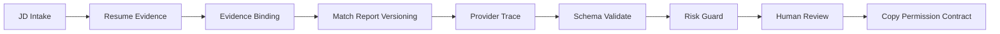
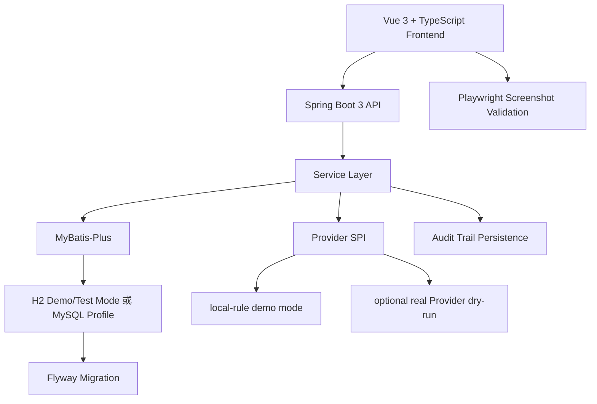

# OfferFlow Copilot

[](https://github.com/jameswilson87156-del/offerflow-copilot/actions/workflows/ci.yml)

OfferFlow Copilot 是一个面向求职场景的 Java + AI workflow 作品集项目，用来展示 JD 入库、简历证据管理、匹配报告版本化、Provider Trace、Schema/Risk 校验、Human Review 与 Copy Permission Contract 如何串成一条可审计的工程链路。

一句话英文定位：
Java + AI workflow demo for JD intake, resume evidence management, match report versioning, human review, provider traceability, and copy permission governance.

## 项目定位

这个项目不是普通的 JD 分析器，也不是生产级招聘平台。它更关注 AI 输出进入求职材料工作流后的治理问题：内容从哪里来、是否有简历证据支撑、是否通过风险校验、是否经过人工复核、是否允许复制。

核心目标：

- 用 Spring Boot 3 + MyBatis-Plus + Flyway 搭建可运行的 Java 后端工作流。
- 用 Vue 3 + TypeScript 展示 JD、证据、报告、复核、Provider Trace 和复制门禁。
- 用 H2 demo/test mode 保证本地和 CI 可复现，MySQL profile 与 Docker Compose 用于本地兼容验证。
- 用 Provider SPI、Prompt / Schema Contract、Provider Response Validator、Risk Guard 和 Trace Evidence 约束 AI / local-rule 输出。
- 用 Human Review 与 Copy Permission Contract 避免生成内容被直接复制使用。

## 核心工作流



链路说明：

- `JD Intake`：手动录入脱敏 JD，生成结构化 parse version。
- `Resume Evidence`：维护简历证据、状态、审计记录和边界说明。
- `Match Report Versioning`：把 JD 要求与证据绑定，生成可版本化的匹配报告。
- `Provider Trace`：记录 provider mode、schema、risk、fallback、traceId 等状态。
- `Schema Validate` + `Risk Guard`：校验结构化输出和禁用表述。
- `Human Review`：人工确认内容是否有证据、是否夸大、是否需要退回。
- `Copy Permission Contract`：复核 confirmed 后仍需通过复制契约，确认前 `copyAllowed=false`。

## 架构概览



默认运行路径是 deterministic `local-rule`，使用 H2 seeded demo data，不需要真实 API Key，也不需要外部 Provider。MySQL profile 只用于本地开发和 schema 兼容验证，不代表生产部署。

## 真实运行截图证据

以下截图均由 Playwright 从真实运行页面生成，来源只使用 `docs/images/` 和 `docs/images/large/`。设计参考图不作为运行截图证据。

| 页面 | 证明点 | 1440 截图 | 1920 截图 | 1366 / overflow 检查 |
| --- | --- | --- | --- | --- |
| JD Analyzer / Structured JD Intake | JD 入库、解析版本、证据绑定、工作台导航 | [docs/images/offerflow-dashboard.png](docs/images/offerflow-dashboard.png) | [docs/images/large/offerflow-dashboard.png](docs/images/large/offerflow-dashboard.png) | Playwright route overflow validation |
| Resume Evidence Library | 证据卡片、详情、覆盖度、编辑/复核审计 | [docs/images/offerflow-evidence-library.png](docs/images/offerflow-evidence-library.png) | [docs/images/large/offerflow-evidence-library.png](docs/images/large/offerflow-evidence-library.png) | [docs/images/offerflow-evidence-library-1366.png](docs/images/offerflow-evidence-library-1366.png) |
| Match Report | 报告版本、证据来源、得分解释、复制门禁 | [docs/images/offerflow-match-report.png](docs/images/offerflow-match-report.png) | [docs/images/large/offerflow-match-report.png](docs/images/large/offerflow-match-report.png) | [docs/images/offerflow-match-report-1366.png](docs/images/offerflow-match-report-1366.png) |
| Interview Prep | 面试准备草稿、复核状态、复制权限 | [docs/images/offerflow-interview-prep.png](docs/images/offerflow-interview-prep.png) | [docs/images/large/offerflow-interview-prep.png](docs/images/large/offerflow-interview-prep.png) | Playwright route overflow validation |
| Application Tracker | 手动投递状态跟踪，不做 auto-apply | [docs/images/offerflow-application-tracker.png](docs/images/offerflow-application-tracker.png) | [docs/images/large/offerflow-application-tracker.png](docs/images/large/offerflow-application-tracker.png) | Playwright route overflow validation |
| Human Review | 复核队列、审计轨迹、风险状态、confirmed/copy 边界 | [docs/images/offerflow-human-review.png](docs/images/offerflow-human-review.png) | [docs/images/large/offerflow-human-review.png](docs/images/large/offerflow-human-review.png) | [docs/images/offerflow-human-review-1366.png](docs/images/offerflow-human-review-1366.png) |
| Provider Settings / Trace | Provider descriptors、config check、Prompt / Schema Contract、trace timeline、dry-run 边界 | [docs/images/offerflow-provider-trace.png](docs/images/offerflow-provider-trace.png) | [docs/images/large/offerflow-provider-trace.png](docs/images/large/offerflow-provider-trace.png) | Playwright route overflow validation |

## 工程亮点

- Spring Boot 3 + Java 17 后端工作流。
- Vue 3 + TypeScript + Vite 前端展示。
- MyBatis-Plus persistence layer。
- Flyway 管理 H2 / MySQL schema migration。
- H2 demo/test mode，支持本地快速复现。
- MySQL profile + Docker Compose MySQL，用于本地兼容验证。
- Provider SPI：统一 `local-rule`、no-op adapters 和 optional real Provider dry-run path。
- Prompt / Schema Contract：为 ProviderTaskType 绑定 promptVersion、schemaVersion 和 required fields。
- Provider Response Validator：校验 schemaVersion、required fields、`rawResponseSaved=false` 和禁用表述。
- Risk Guard：拦截 Offer 概率、录取概率、保证通过、实时面试辅助等风险表达。
- Trace Evidence：保留 provider、fallback、schema validation、risk flags、traceId 等可复核状态。
- Human Review Audit Trail：记录复核流转、退回、归档、恢复和人工备注。
- Copy Permission Contract：复制行为必须等待 Human Review confirmed 并通过复制契约。
- GitHub Actions：自动运行 backend tests、frontend build 和 screenshot validation。
- Playwright：生成真实运行截图并做 1366 viewport horizontal overflow 检查。

## 真实 Provider 手动 dry-run

项目支持可选的真实 Provider 手动 dry-run 路径，但默认关闭，不作为对外可用模型服务能力声明。

准确表述：

- 支持 optional real Provider dry-run path。
- 默认关闭，CI 和普通 demo 不依赖真实 Provider。
- API Key 仅从环境变量读取，不写入 README、日志、测试、截图或数据库。
- `rawResponseSaved=false`。
- 已使用脱敏输入手动验证过 DeepSeek 和 OpenAI-compatible relay。
- 输出仍必须经过 Schema Validate、Risk Guard、Human Review 和 Copy Permission。
- 复核 confirmed 前 `copyAllowed=false`。

不能把这条路径表述为生产环境稳定可用的模型接入能力，也不能暗示生成结果可绕过复核或复制门禁。详见 [docs/real-provider-dry-run.md](docs/real-provider-dry-run.md) 和 [docs/manual-provider-dry-run-verification.md](docs/manual-provider-dry-run-verification.md)。

## 快速启动

Backend:

```bash
mvn spring-boot:run
```

Frontend:

```bash
cd frontend
npm install
npm run dev
```

默认行为：

- 使用 H2 demo mode。
- 使用 `local-rule` 确定性规则路径。
- 不需要真实 API Key。
- 不需要 MySQL 即可运行 demo。
- 启动时加载脱敏 seeded demo data。

可选本地 MySQL：

```bash
docker compose up -d mysql
mvn spring-boot:run -Dspring-boot.run.profiles=mysql
docker compose stop mysql
```

MySQL profile 和 Docker Compose 只用于本地开发/demo 验证，不代表生产部署方案。

## 验收结果

当前本地验收：

- `mvn test`: 126 tests passed
- `npm run build`: passed
- `npm run screenshots`: 18 passed
- `git diff --check`: passed

GitHub Actions CI 在 `push` 和 `pull_request` 时覆盖 backend tests、frontend build 和 Playwright screenshot validation。CI 使用 demo/local-rule mode，不需要真实 Provider API Key，也不会调用真实 Provider。

如果测试数量后续变化，请以最新命令输出为准。

## 发布与展示文档

- [Release notes: v0.1.0-portfolio](docs/release-notes-v0.1.0-portfolio.md)
- [Demo walkthrough for HR / interview review](docs/demo-walkthrough.md)
- [Screenshot manifest](docs/screenshot-manifest.md)
- [CI verification notes](docs/ci.md)
- [Resume bullets and talk track](docs/resume-bullets.md)

## 项目边界

- 这是 portfolio-grade engineering demo。
- 不是生产级招聘平台。
- 不接招聘平台 API。
- 不爬虫。
- 不自动投递。
- 不保存真实用户隐私。
- 不输出 Offer 概率、录取概率或保证通过。
- 不做实时面试辅助或作弊功能。
- 本地权限模型不是生产级 authentication / authorization。
- 默认 `local-rule`，真实 Provider dry-run 手动、可选、默认关闭。
- 不保存 raw provider response。
- Copy Permission 必须等待 Human Review confirmed 且 Copy Permission Contract 通过。

更多边界说明见 [docs/project-boundary.md](docs/project-boundary.md) 和 [docs/portfolio-claims.md](docs/portfolio-claims.md)。

## 面试讲解要点

- 为什么 AI 生成内容不能默认直接复制。
- 为什么 Human Review 是安全门禁，而不是 UI 装饰。
- 为什么 Copy Permission 要独立于生成和复核。
- 为什么不保存 API Key 和 raw provider response。
- Provider 失败时为什么必须 fallback，并保留明确 Trace Evidence。
- `local-rule`、no-op provider 和 manual real Provider dry-run 的区别。
- Flyway + H2 + MySQL 兼容为什么能体现 Java 后端工程能力。
- Trace Evidence 如何证明输出经过了哪些 schema、risk、review、copy gate。
