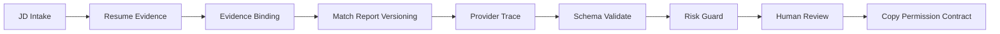
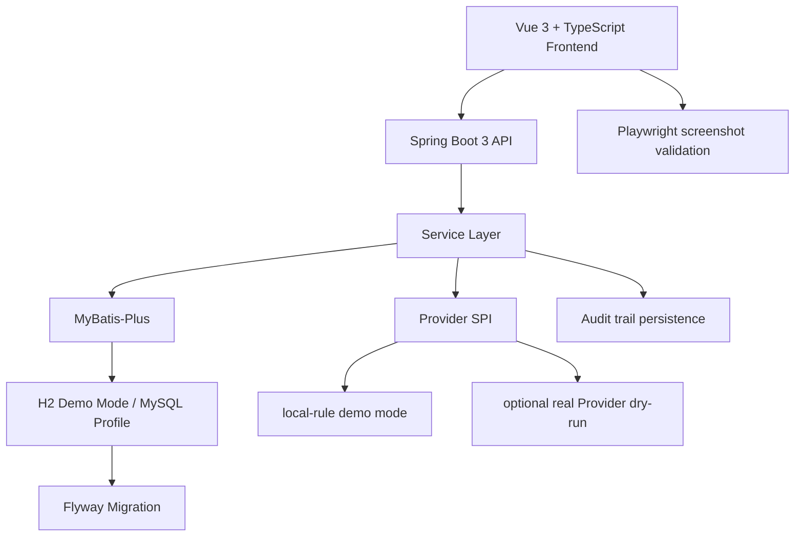

# OfferFlow Copilot

[](https://github.com/jameswilson87156-del/offerflow-copilot/actions/workflows/ci.yml)

Java + AI workflow demo for JD intake, resume evidence management, match report versioning, human review, provider traceability, and copy permission governance.

OfferFlow Copilot 是一个面向求职场景的 Java + AI 工作流作品集项目，用于展示 JD 入库、简历证据管理、匹配报告版本化、人工复核、Provider Trace、Schema/Risk 校验与复制门禁治理。

## Why This Exists

OfferFlow Copilot is not a generic JD analyzer. It is an evidence-first AI workflow demo:

- It does not directly trust generated provider output.
- Resume evidence is collected, reviewed, and bound before report generation.
- Match reports are versioned and auditable.
- Draft output goes through Human Review before it can become confirmed content.
- Copy Permission is a separate final gate after review.
- Provider output is traceable through prompt, schema, risk, fallback, review, and copy states.

## Core Workflow



## Architecture Overview



The default mode is deterministic `local-rule` with H2 seeded demo data. MySQL is available for local development through a profile and Docker Compose. The optional real Provider dry-run path is disabled by default and remains review-gated.

## Screenshot Evidence

These screenshots are generated from the running app by Playwright. Runtime screenshots come from `docs/images/` and `docs/images/large/`; design reference images under `docs/design/references/` are not used as runtime evidence.

| Area | What it proves | 1440 Screenshot | 1920 Screenshot | 1366 / Overflow Check |
| --- | --- | --- | --- | --- |
| JD Analyzer / Structured JD Intake | JD intake, parsing version context, evidence binding, and workbench navigation | [docs/images/offerflow-dashboard.png](docs/images/offerflow-dashboard.png) | [docs/images/large/offerflow-dashboard.png](docs/images/large/offerflow-dashboard.png) | Covered by Playwright route overflow validation |
| Resume Evidence Library | Evidence cards, evidence detail, coverage map, edit/review audit context | [docs/images/offerflow-evidence-library.png](docs/images/offerflow-evidence-library.png) | [docs/images/large/offerflow-evidence-library.png](docs/images/large/offerflow-evidence-library.png) | [docs/images/offerflow-evidence-library-1366.png](docs/images/offerflow-evidence-library-1366.png) |
| Match Report | Versioned report, evidence source binding, score explanation, and copy gate | [docs/images/offerflow-match-report.png](docs/images/offerflow-match-report.png) | [docs/images/large/offerflow-match-report.png](docs/images/large/offerflow-match-report.png) | [docs/images/offerflow-match-report-1366.png](docs/images/offerflow-match-report-1366.png) |
| Interview Prep | Review-gated interview prep and copy permission status | [docs/images/offerflow-interview-prep.png](docs/images/offerflow-interview-prep.png) | [docs/images/large/offerflow-interview-prep.png](docs/images/large/offerflow-interview-prep.png) | Covered by Playwright route overflow validation |
| Application Tracker | Manual application status tracking without auto-apply behavior | [docs/images/offerflow-application-tracker.png](docs/images/offerflow-application-tracker.png) | [docs/images/large/offerflow-application-tracker.png](docs/images/large/offerflow-application-tracker.png) | Covered by Playwright route overflow validation |
| Human Review | Review queue, audit trail, risk state, and confirmed/copy boundary | [docs/images/offerflow-human-review.png](docs/images/offerflow-human-review.png) | [docs/images/large/offerflow-human-review.png](docs/images/large/offerflow-human-review.png) | [docs/images/offerflow-human-review-1366.png](docs/images/offerflow-human-review-1366.png) |
| Provider Settings / Trace | Provider descriptors, config check, prompt/schema contract, trace timeline, and dry-run boundary | [docs/images/offerflow-provider-trace.png](docs/images/offerflow-provider-trace.png) | [docs/images/large/offerflow-provider-trace.png](docs/images/large/offerflow-provider-trace.png) | Covered by Playwright route overflow validation |

## Release Package

- [Release notes: v0.1.0-portfolio](docs/release-notes-v0.1.0-portfolio.md)
- [Demo walkthrough for HR / interview review](docs/demo-walkthrough.md)
- [Screenshot manifest](docs/screenshot-manifest.md)
- [CI verification notes](docs/ci.md)

## Engineering Highlights

- Spring Boot 3 + Java 17
- Vue 3 + TypeScript + Vite
- MyBatis-Plus persistence layer
- H2 demo mode
- MySQL profile and Docker Compose MySQL for local development
- Flyway-managed schema migration
- Provider SPI with `local-rule`, no-op adapters, and manual dry-run boundary
- Prompt / Schema Contract registry
- Provider Response Validator
- Risk Policy Guard
- Trace Evidence persistence
- Human Review Audit Trail
- Resume Evidence Audit
- JD Intake Audit
- Match Report Versioning
- Copy Permission Contract
- Local Permission Workflow
- Playwright screenshot validation
- Maven test coverage

## Real Provider Dry-run

The project includes an optional real Provider dry-run path that has been manually verified with DeepSeek and an OpenAI-compatible relay using sanitized input only.

Accurate wording:

- Optional real Provider dry-run path.
- Disabled by default.
- API keys are read from environment variables only.
- `rawResponseSaved=false`.
- DeepSeek manual dry-run verified.
- OpenAI-compatible relay manual dry-run verified.
- Outputs still require Schema Validate, Risk Guard, Human Review, and Copy Permission.
- `copyAllowed=false` before confirmation.

This is a manual-only dry-run path, not production provider integration or a vendor-backed model-service claim. Raw provider responses and API keys are not recorded in docs, tests, screenshots, logs, database rows, or commits.

See [docs/real-provider-dry-run.md](docs/real-provider-dry-run.md) and [docs/manual-provider-dry-run-verification.md](docs/manual-provider-dry-run-verification.md).

## Quick Start

Backend:

```bash
mvn spring-boot:run
```

Frontend:

```bash
cd frontend
npm install
npm run dev
```

Default behavior:

- Runs with H2 demo mode.
- Does not require real API keys.
- Does not require MySQL to run the demo.
- Seeds sanitized demo data through the application startup path.

Optional local MySQL:

```bash
docker compose up -d mysql
mvn spring-boot:run -Dspring-boot.run.profiles=mysql
docker compose stop mysql
```

The MySQL profile is for local development/demo validation only. It is not a production deployment statement.

## Verification

Current local acceptance:

- `mvn test`: 126 tests passed
- `npm run build`: passed
- `npm run screenshots`: 18 passed
- `git diff --check`: passed

GitHub Actions CI covers backend tests, frontend build, and screenshot validation on `push` and `pull_request`. CI runs in demo/local-rule mode and does not require real Provider API keys.

If the test count changes, trust the latest command output over this README.

## Project Boundaries

- Portfolio-grade engineering demo.
- Not a production recruiting platform.
- No recruiting platform API integration.
- No crawler.
- No auto-apply.
- No real user data.
- No Offer prediction, admission probability, or guaranteed pass claim.
- No real-time interview assistance or cheating feature.
- Local permission model is demo-level, not production authentication/authorization.
- Real Provider dry-run is manual and disabled by default.
- Raw provider response is not saved.
- Copy permission requires a Human Review confirmed state and Copy Permission Contract pass.

More detail: [docs/project-boundary.md](docs/project-boundary.md) and [docs/portfolio-claims.md](docs/portfolio-claims.md).

## Interview Talking Points

- Why generated AI output should not be directly copyable.
- Why Human Review is a safety gate rather than a UI decoration.
- Why Copy Permission only allows confirmed content.
- Why raw provider responses and API keys are not saved.
- Why provider failures must fall back with explicit trace evidence.
- How `local-rule`, no-op providers, and manual real dry-run differ.
- Why Flyway + H2 + MySQL compatibility matters for a Java portfolio project.
- How Trace Evidence proves where a generated output came from and which gates it passed.
