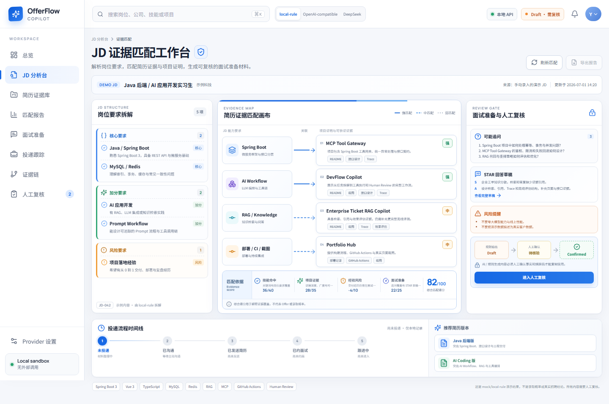

# OfferFlow Copilot

OfferFlow Copilot 是一个真实可运行的 Java + AI 应用作品集工程项目。它面向实习求职场景，用可审阅的工作台串联“JD 要求 → 简历证据 → 项目证明 → 面试准备 → 人工复核”。

## 当前阶段：P1A + P1B

当前版本只提供高保真静态工作台、mock 数据与 `local-rule` 后端接口。它不代表完整招聘业务，也不代表真实 Provider 已稳定接入。

- 不接招聘平台 API，不爬取网页。
- 不保存真实手机号、邮箱、身份证、聊天记录等隐私。
- 不做实时面试作弊。
- 不输出 Offer 概率、录取概率，不承诺录取结果。
- `local-rule` fallback 是演示规则，不是真实稳定 LLM。
- 后续可扩展 OpenAI-compatible / DeepSeek，但当前 `realCallEnabled=false`。

## 技术栈

- 后端：Java 17、Spring Boot 3、Maven
- 前端：Vue 3、Vite、TypeScript、原生 CSS
- 截图：Playwright

## 工作台预览

下图由本地 Vue 页面通过 Playwright 真实渲染生成，内容均为 mock/local-rule 演示数据。



## P1 接口

| 方法 | 路径 | 说明 |
| --- | --- | --- |
| GET | `/api/health` | 工程状态与数据模式 |
| GET | `/api/provider/status` | Provider 就绪状态与 fallback 边界 |
| GET | `/api/dashboard/summary` | mock 首页统计 |
| GET | `/api/jobs/demo-analysis` | 完整 JD 证据链演示数据 |

## 本地运行

```bash
# 后端，默认 http://localhost:8080
mvn spring-boot:run

# 前端，默认 http://localhost:5173
cd frontend
npm install
npm run dev
```

Vite 开发服务器会将 `/api` 代理到本地 Spring Boot。前端无法访问后端时，会明确显示“演示快照”，不会将其伪装成真实 Provider 结果。

## 验收

```bash
mvn test
cd frontend
npm run build
npm run screenshots
git diff --check
```

更多边界与实现说明见 [项目边界](docs/project-boundary.md)、[架构说明](docs/architecture.md) 与 [设计说明](docs/design/README.md)。
